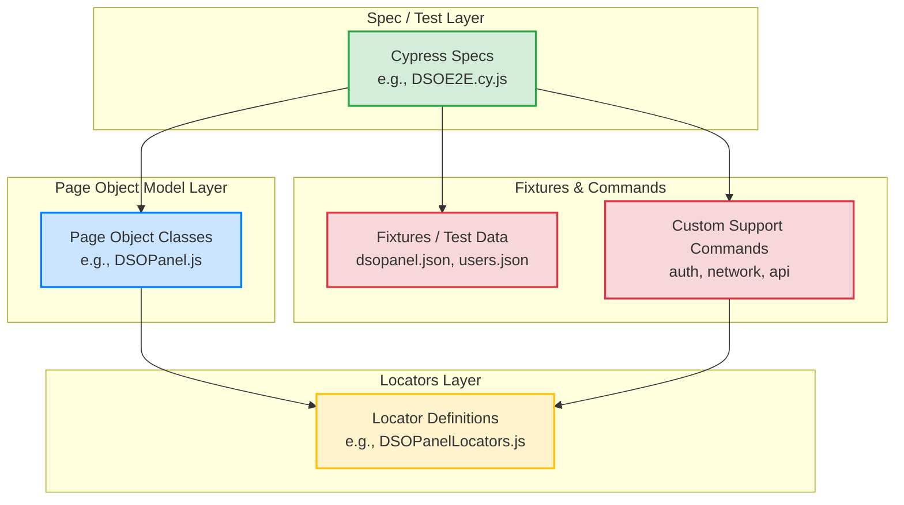
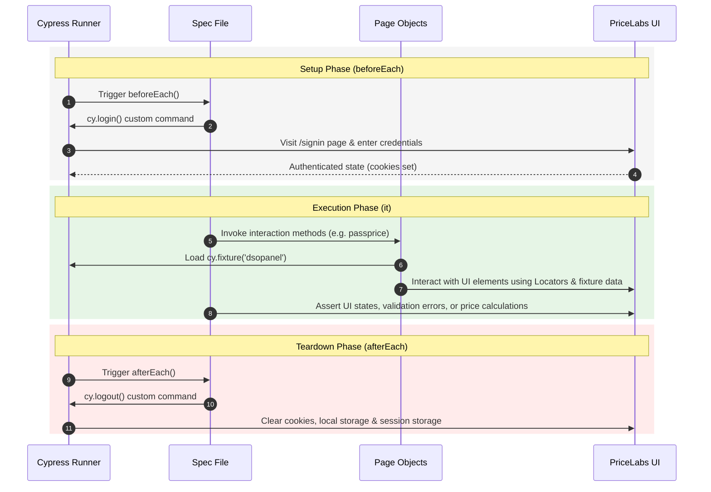

# PriceLabs Cypress QA Automation Framework

<p align="center">
  
</p>

This repository leverages the **Hybrid Page Object Model (POM)** with strict separation of selectors, robust asynchronous command handling, dynamic fixture data injection, and automated reporting.

---

## 🏗️ Core Architecture & Design Details

This framework adheres to professional software engineering and test automation standards. It is decoupled into independent layers to achieve maximum reusability, easy maintenance, and zero test-flakiness.

### 1. Framework Architecture Diagram



### 2. Test Execution Lifecycle Flow

Every UI test in the suite undergoes a rigorous lifecycle to maintain complete isolation, ensuring that database or authentication state never leaks across boundaries.



---

## 🧩 Key Architecture Principles

1. **Strict Separation of Selectors (Locators)**: Selectors are kept inside dedicated `/locators/` JS files. Page Objects only hold the operational business logic. If a UI class or property changes, you only modify a single string inside the locator file without touching the action logic.
2. **Action-Only Page Objects**: Page Objects are strictly responsible for performing actions. They **never contain assertions**. Assertions are co-located in the spec files to keep tests readable and expressive.
3. **Flake-Free Waiting Strategy**: Hardcoded `cy.wait(<number>)` calls are strictly banned. The framework leverages explicit intercepts (`cy.intercept()`), DOM element visibility checks, and aliased network waits (e.g., `@dsoSave`, `@calendarLoad`) to handle network latency smoothly.
4. **Data-Driven Testing (Fixtures)**: Hardcoded interaction values are avoided. Interaction inputs are externalized in `cypress/fixtures/` JSON structures (e.g., `dsopanel.json` for percentage override values).
5. **State Isolation**: Each test runs inside a fresh browser context. `beforeEach` runs a fresh login flow and `afterEach` clears state completely.
6. **Force Clicks for Covered Elements**: Elements inside the interactive multicalendar grid that have layout overlays (e.g. text elements covering cells) use Cypress `{ force: true }` clicks to ensure consistent element actionability.

---

## 🎯 Test Suite Matrix

| Spec File | Spec Type | Covered Scenarios |
|---|---|---|
| 🔑 `login-verify.cy.js` | UI / Positive & Negative | • Valid login verification.<br>• Login failure with invalid email or password. |
| 🎛️ `dso-functional.cy.js` | UI Functional | • Single date DSO price and stay override.<br>• Bulk dates DSO price and stay override. |
| 🧪 `dso-negative.cy.js` | UI Validation | • Validation check for non-numeric custom pricing percent input (displays: *"Percentage custom pricing needs to be a number"*). |
| 🔌 `dso-api-ui-integration.cy.js` | Hybrid API & UI | • Saves custom pricing via Cypress backend REST API POST first, then loads the Multicalendar UI grid to verify that changes reflect seamlessly. |
| 🏆 `DSOE2E.cy.js` | End-to-End E2E | • **Single Day E2E**: Inputs custom price/stay, saves, opens panel, asserts that the price summary equals the hover Final price.<br>• **Bulk Dates E2E**: Bulk inputs price/stay, saves, opens panel, asserts that the price summary equals the hover Final price. |

---

## 📁 Directory Structure & Walkthrough

Here is a comprehensive breakdown of the project layout:

```text
Pricelabs_Assesment_Sneha/
├── cypress/
│   ├── e2e/                             # Test spec files
│   │   ├── multicalendar/
│   │   │   ├── dso-api-ui-integration.cy.js  # Hybrid backend API & frontend UI grid validation
│   │   │   ├── dso-functional.cy.js          # Main functional tests (Single/Bulk DSO changes)
│   │   │   └── dso-negative.cy.js            # Input validation and error scenario checks
│   │   ├── DSOE2E.cy.js                 # Complete End-to-End flow verifying price calculations
│   │   └── login-verify.cy.js           # Authentication specs (valid/invalid credentials)
│   │
│   ├── fixtures/                        # Dynamic and static test data
│   │   ├── addCustomPricing.json        # Mock JSON payload for API injection
│   │   ├── filtered_listings.json       # Mock JSON for search results filtering
│   │   ├── listings.json                # Dump of available listings retrieved at runtime
│   │   ├── users.json                   # Reference keys for env credentials & static bad logins
│   │   └── dsopanel.json                # Pricing fixture for DSO form input (Price, minPrice, maxPrice, basePrice)
│   │
│   ├── locators/                        # Selectors only (No logic, no assertions)
│   │   ├── DSO/
│   │   │   └── DSOPanelLocators.js      # Locators for Daily Stay Override modal elements
│   │   ├── LoginLocators.js             # Sign-in page element locators
│   │   └── MulticalendarLocators.js     # Multicalendar grid elements, cells, tooltips & search filters
│   │
│   ├── pages/                           # Page Objects (POM action methods)
│   │   ├── DSO/
│   │   │   └── DSOPanel.js              # DSO Panel interactions (typing prices, adding/updating overrides)
│   │   ├── BasePage.js                  # Shared page actions (visiting, URL checks)
│   │   ├── LoginPage.js                 # Login inputs, submit, and error form triggers
│   │   └── MulticalendarPage.js         # Multicalendar searches, scrolling, filtering, cell selection
│   │
│   ├── support/                         # Global hooks and custom Cypress commands
│   │   ├── api/
│   │   │   └── ApiClient.js             # High-level wrapper for backend cy.request() commands
│   │   ├── commands/
│   │   │   ├── auth.commands.js         # custom commands (cy.login, cy.logout, cy.dismissRecommendationsPopup)
│   │   │   └── network.commands.js      # custom commands (cy.requestListingsAndExtractId, network intercepts)
│   │   ├── e2e.js                       # Framework setup hooks, mocha config, and report attachments
│   │   └── index.d.ts                   # TypeScript IntelliSense auto-complete declarations for custom commands
│   │
│   ├── reports/                         # Autogenerated mochawesome reports folder (gitignored)
│   └── screenshots/                     # Autogenerated test failure screenshots (gitignored)
│
├── cypress.config.js                    # Core Cypress execution configuration (timeouts, viewports, reporting)
├── cypress.env.json                     # Local workspace credential variables (gitignored)
├── package.json                         # Node dependencies, scripts, and reporting plug-ins
└── README.md                            # Comprehensive framework documentation
```

---

## 🛠️ Step-by-Step Setup Guide

Follow this guide chronologically to get the automation framework running locally on your machine.

### 📋 Prerequisites

Before you start, ensure you have the following software installed:
1. **Node.js**: `v18.0.0` or higher (Recommended: LTS version). Check via terminal: `node -v`
2. **npm**: `v9.0.0` or higher. Check via terminal: `npm -v`
3. **Cypress Credentials**: Valid credentials (email, password) to access the PriceLabs platform.

---

### 💻 Chronological Installation Steps

#### Step 1: Clone the Repository
Open your terminal and clone the assessment repository:
```bash
git clone <repository_url>
cd Pricelabs_Assesment_Sneha
```

#### Step 2: Install Node Dependencies
Install all framework dependencies (including Cypress and Mochawesome reporters):
```bash
npm install
```

#### Step 3: Configure Environment Credentials
The framework expects credentials to be loaded securely from a `cypress.env.json` file in the root directory. This file is gitignored so secrets are never pushed to version control.

Create a file named `cypress.env.json` in the root of the project:
```json
{
  "username": "YOUR_PRICELABS_ACCOUNT_EMAIL",
  "password": "YOUR_PRICELABS_ACCOUNT_PASSWORD",
  "apiBaseUrl": "https://api.pricelabs.co"
}
```

> [!IMPORTANT]
> Replace `YOUR_PRICELABS_ACCOUNT_EMAIL` and `YOUR_PRICELABS_ACCOUNT_PASSWORD` with your active PriceLabs credentials.

---

## 🚀 Running the Tests

The framework comes configured with several execution scripts depending on your mode of choice.

### 🖥️ Interactive GUI Mode (Cypress Test Runner)
To open the interactive Cypress GUI, where you can watch tests run in real-time, select specific specs, and debug selectors:
```bash
npm run cy:open
```

### 🤖 Headless CLI Mode (Headed or Headless Execution)
To run all test suites headlessly in the terminal:
```bash
npm run cy:run
```

To run all test suites in headed mode (visible browser window):
```bash
npm run cy:run:headed
```

### 🎯 Running Specific Test Specs
To run specific tests quickly, use the following customized scripts:

* **Authentication Tests**:
  ```bash
  npm run cy:run:login
  ```
* **DSO Functional Tests**:
  ```bash
  npm run cy:run:dso-functional
  ```
* **DSO Negative Validation Tests**:
  ```bash
  npm run cy:run:dso-negative
  ```
* **Hybrid API & UI Integration Tests**:
  ```bash
  npm run cy:run:dso-integration
  ```
* **Price Calculation End-to-End E2E Tests**:
  ```bash
  npm run cy:run:e2eflow
  ```

---

## 📊 Autogenerated Test Reports

The project has integrated `cypress-mochawesome-reporter`. This plugin compiles the test run status and embeds a visual layout.

### Report Characteristics:
* **Interactive Charts**: Displays colorful circular charts of passed, failed, and skipped specs.
* **Failure Screenshots**: If any test fails, Cypress automatically takes a screenshot, and Mochawesome **embeds the screenshot inline** directly beneath the failed test trace in the HTML report.
* **Self-Contained**: The assets are bundled inline, making it extremely easy to open the report on any device or upload it to your CI/CD workflow.

### Accessing Reports:
After running a test spec through headless mode (`npm run cy:run` or spec-specific run commands), open the following file in any standard browser:
```text
c:\Users\brist\Downloads\Assesment\Pricelabs_Assesment_Sneha\cypress\reports\index.html
```

---

## ✍️ Author
**Sneha Sengupta** — PriceLabs QA Automation Assessment