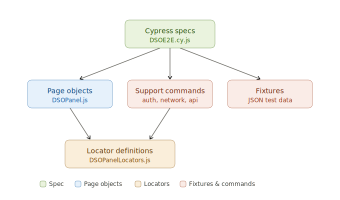
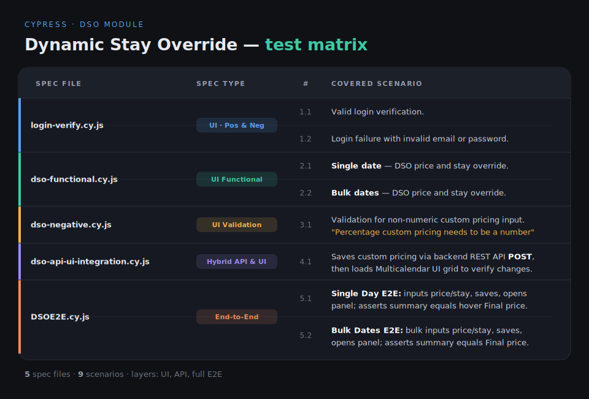
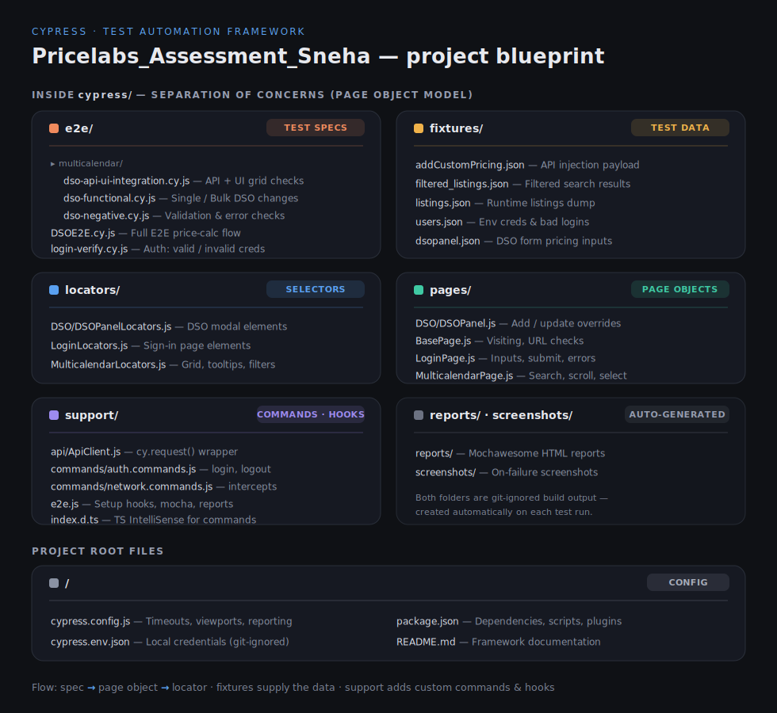

# PriceLabs Cypress QA Automation Framework
This repository leverages the **Hybrid Page Object Model (POM)** with strict separation of selectors, robust asynchronous command handling, dynamic fixture data injection, and automated reporting.

---

## 🏗️ Core Architecture & Design Details

This framework adheres to professional software engineering and test automation standards. It is decoupled into independent layers to achieve maximum reusability, easy maintenance, and zero test-flakiness.

### 1. Framework Architecture Diagram



### 2. Test Execution Lifecycle Flow

Every UI test in the suite undergoes a rigorous lifecycle to maintain complete isolation, ensuring that database or authentication state never leaks across boundaries.



### 3. Framework Data Flow Diagram

The following diagram tracks the lifecycle of test data—from static configuration files and runtime API calls to page object inputs and final test assertions.



### 🔍 4. Spec Files - Detailed End-to-End Logic & Workflows

Here is the operational logic and step-by-step workflow for each spec file in the framework:

#### 🔑 `login-verify.cy.js` (Authentication Module)
* **Logic**: Validates both success and failure states of the authentication flow.
* **Positive Flow**:
  1. Calls `cy.login()` which reads credentials from the secure `cypress.env.json`.
  2. Visits the `/signin` page, inputs the username/password, and submits.
  3. Asserts the URL no longer contains `/signin`, validating a successful dashboard entry.
* **Negative Flow**:
  1. Pulls invalid credentials from `users.json` fixture.
  2. Submits the form with bad inputs.
  3. Asserts that the validation banner renders the correct error message (*"Invalid email or password."*).

#### 🎛️ `dso-functional.cy.js` (DSO Browser Interactions)
* **Logic**: Simulates typical user operations for setting individual and bulk overriding rules.
* **Single Day Override Flow**:
  1. Authenticates, visits the multicalendar grid, and triggers the listing filter.
  2. Calls `cy.requestListingsAndExtractId()` to extract a real, active listing ID from the listings API, avoiding hardcoded ids.
  3. Searches and selects that specific listing in the list filter, and clicks "Show".
  4. Clicks the grid cell for the primary column offset (`data-col-index="4"`).
  5. Enters custom overriding prices and stays fetched from the `dsopanel` fixture.
  6. Saves and submits the row.
* **Bulk Dates Override Flow**:
  1. Authenticates and filters down to the active listing.
  2. Clicks the second grid cell index (`data-col-index="5"`).
  3. Interacts with the DSO bulk calendar popup to assign a multi-day range.
  4. Inputs pricing, clicks add, updates, and saves the multicalendar row.

#### 🧪 `dso-negative.cy.js` (UI Validation & Edge Cases)
* **Logic**: Ensures the application correctly handles invalid inputs and prevents corrupt payloads from reaching save states.
* **Non-Numeric Verification Flow**:
  1. Authenticates and filters to the active listing.
  2. Selects the target multicalendar cell and launches the override panel.
  3. Inputs a bad alphanumeric value (`"abc"`) into the percentage pricing field.
  4. Submits the custom pricing action.
  5. Captures the error tooltip element and asserts that the application displays: *"Percentage custom pricing needs to be a number"*.

#### 🔌 `dso-api-ui-integration.cy.js` (Hybrid API & UI Sync)
* **Logic**: Bypasses the UI to trigger data changes via direct REST requests, verifying that the frontend correctly listens and renders synced backend states.
* **Hybrid Integration Flow**:
  1. In the `beforeEach` hook, loads the mock override JSON payload `addCustomPricing.json`.
  2. Calls the custom support command `cy.addCustomPricing(payload)` which sends a native `cy.request()` HTTP `POST` to the PriceLabs REST API.
  3. Asserts that the server response status code is `200 OK`.
  4. Logs into the UI, filters the target listing, and scrolls the multicalendar grid into view.
  5. Performs visual grid verification to confirm the API changes are actively rendered on the calendar cell.

#### 🏆 `DSOE2E.cy.js` (End-to-End Price Calculation Integration)
* **Logic**: Tests the absolute integrity of calculation logic by comparing values calculated inside the modal panel against values displayed on cell hovers.
* **E2E single Day / Bulk Dates Workflows**:
  1. Authenticates, filters the listing, and opens the DSO overriding panel.
  2. Populates override prices and stays from the `dsopanel.json` fixture.
  3. Saves the row and re-opens the override panel.
  4. Calls `getPriceSummary()` which extracts the calculated "Total:" amount from the modal text and registers it as `@totalValue`.
  5. Closes the panel without saving changes, returning to the grid.
  6. Calls `fetchFinalPrice()` which moves the mouse over the final price display element in the grid cell, triggers the hover tooltip, parses the price text, and registers it as `@finalPrice`.
  7. Retrives both values and runs the core assertion: `expect(total).to.eq(final)`.

---

## 🧩 Key Architecture Principles

1. **Strict Separation of Selectors (Locators)**: Selectors are kept inside dedicated `/locators/` JS files. Page Objects only hold the operational business logic. If a UI class or property changes, you only modify a single string inside the locator file without touching the action logic.
2. **Action-Only Page Objects**: Page Objects are strictly responsible for performing actions. They **never contain assertions**. Assertions are co-located in the spec files to keep tests readable and expressive.
3. **Flake-Free Waiting Strategy**: Hardcoded `cy.wait(<number>)` calls are strictly banned. The framework leverages explicit intercepts (`cy.intercept()`), DOM element visibility checks, and aliased network waits (e.g., `@dsoSave`, `@calendarLoad`) to handle network latency smoothly.
4. **Data-Driven Testing (Fixtures)**: Hardcoded interaction values are avoided. Interaction inputs are externalized in `cypress/fixtures/` JSON structures (e.g., `dsopanel.json` for percentage override values).
5. **State Isolation**: Each test runs inside a fresh browser context. `beforeEach` runs a fresh login flow and `afterEach` clears state completely.
6. **Force Clicks for Covered Elements**: Elements inside the interactive multicalendar grid that have layout overlays (e.g. text elements covering cells) use Cypress `{ force: true }` clicks to ensure consistent element actionability.

---

## 🎯 Test Suite Matrix



## 📁 Directory Structure & Walkthrough

Here is a comprehensive breakdown of the project layout:



## 🛠️ Step-by-Step Setup Guide

Follow this guide chronologically to get the automation framework running locally on your machine.

### 📋 Prerequisites

Before you start, ensure you have the following software installed:
1. **Node.js**: `v18.0.0` or higher (Recommended: LTS version). Check via terminal: `node -v`
2. **npm**: `v9.0.0` or higher. Check via terminal: `npm -v`
3. **Cypress Credentials**: Valid credentials (email, password) to access the PriceLabs platform.

---

### 💻 Chronological Installation Steps

#### Step 1: Clone the Repository
Open your terminal and clone the assessment repository:
```bash
git clone <repository_url>
cd Pricelabs_Assesment_Sneha
```

#### Step 2: Install Node Dependencies
Install all framework dependencies (including Cypress and Mochawesome reporters):
```bash
npm install
```

#### Step 3: Configure Environment Credentials
The framework expects credentials to be loaded securely from a `cypress.env.json` file in the root directory. This file is gitignored so secrets are never pushed to version control.

Create a file named `cypress.env.json` in the root of the project:
```json
{
  "username": "YOUR_PRICELABS_ACCOUNT_EMAIL",
  "password": "YOUR_PRICELABS_ACCOUNT_PASSWORD",
  "apiBaseUrl": "/baseurl"
}
```

> [!IMPORTANT]
> Replace `YOUR_PRICELABS_ACCOUNT_EMAIL` and `YOUR_PRICELABS_ACCOUNT_PASSWORD` with your active PriceLabs credentials.

---

## 🚀 Running the Tests

The framework comes configured with several execution scripts depending on your mode of choice.

### 🖥️ Interactive GUI Mode (Cypress Test Runner)
To open the interactive Cypress GUI, where you can watch tests run in real-time, select specific specs, and debug selectors:
```bash
npm run cy:open
```

### 🤖 Headless CLI Mode (Headed or Headless Execution)
To run all test suites headlessly in the terminal:
```bash
npm run cy:run
```

To run all test suites in headed mode (visible browser window):
```bash
npm run cy:run:headed
```

### 🎯 Running Specific Test Specs
To run specific tests quickly, use the following customized scripts:

* **Authentication Tests**:
  ```bash
  npm run cy:run:login
  ```
* **DSO Functional Tests**:
  ```bash
  npm run cy:run:dso-functional
  ```
* **DSO Negative Validation Tests**:
  ```bash
  npm run cy:run:dso-negative
  ```
* **Hybrid API & UI Integration Tests**:
  ```bash
  npm run cy:run:dso-integration
  ```
* **Price Calculation End-to-End E2E Tests**:
  ```bash
  npm run cy:run:e2eflow
  ```

---

## 📊 Autogenerated Test Reports

The project has integrated `cypress-mochawesome-reporter`. This plugin compiles the test run status and embeds a visual layout.

### Report Characteristics:
* **Interactive Charts**: Displays colorful circular charts of passed, failed, and skipped specs.
* **Failure Screenshots**: If any test fails, Cypress automatically takes a screenshot, and Mochawesome **embeds the screenshot inline** directly beneath the failed test trace in the HTML report.
* **Self-Contained**: The assets are bundled inline, making it extremely easy to open the report on any device or upload it to your CI/CD workflow.

### Accessing Reports:
After running a test spec through headless mode (`npm run cy:run` or spec-specific run commands), open the following file in any standard browser:
```text
c:\Users\brist\Downloads\Assesment\Pricelabs_Assesment_Sneha\cypress\reports\index.html
```

---

## ✍️ Author
**Sneha Sengupta** — PriceLabs QA Automation Assessment
